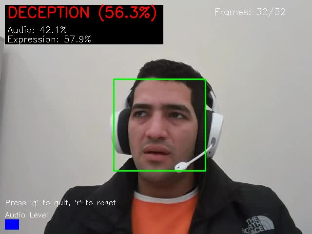
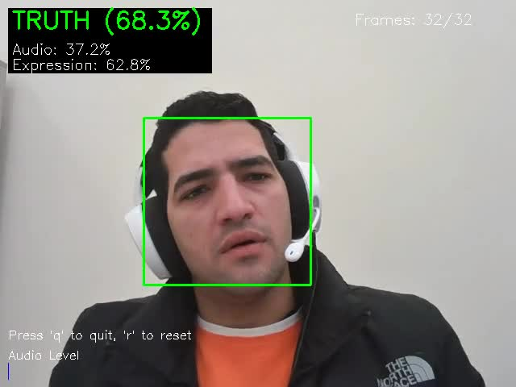
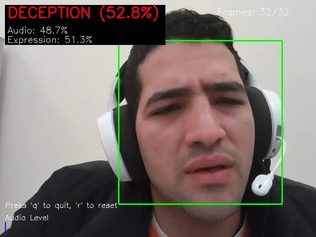
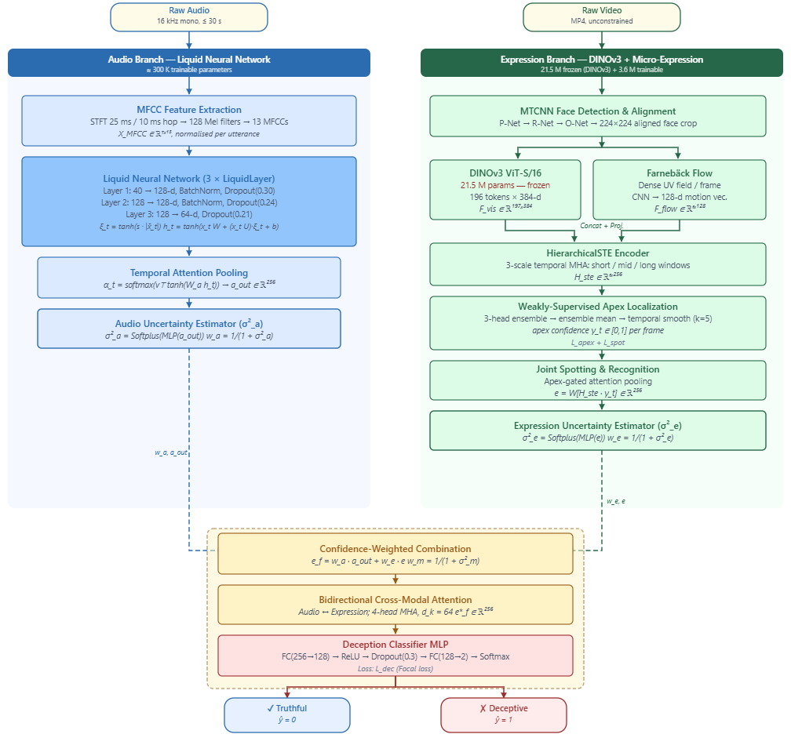
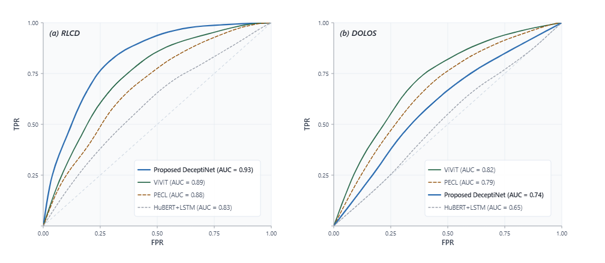
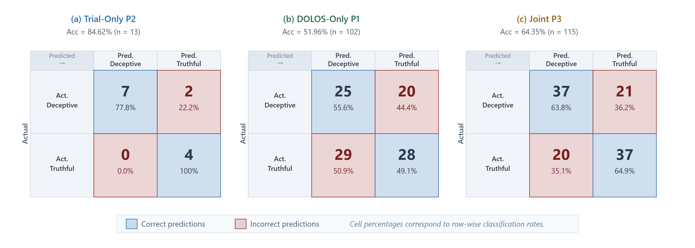
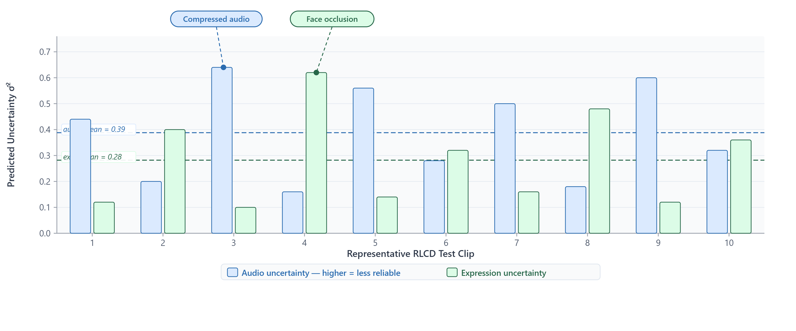

<div align="center">

# 🎭 DeceptiNet — Real-Time Multimodal Deception Detection

**Live deception analysis from your webcam and microphone using a trained deep-learning model.**

[](https://www.python.org/)
[](https://pytorch.org/)
[](LICENSE)
[](https://github.com)

</div>

---

## 🎬 Demo

<div align="center">

| DECEPTION detected | TRUTH detected | Expression captured |
|:---:|:---:|:---:|
|  |  |  |
| Audio: 42.1% · Expression: 57.9% | Audio: 37.2% · Expression: 62.8% | Audio: 48.7% · Expression: 51.3% |

</div>

> Live webcam session: the system simultaneously analyses voice stress (LNN audio branch) and facial micro-expressions (DINOv3) and fuses them with uncertainty-aware cross-modal attention to produce a real-time deception probability. The face bounding box turns **red** for deception and **green** for truth.

---

## 📌 What Is This?

DeceptiNet is a **multimodal deep-learning system** that detects deception in real time by simultaneously analysing:

| Modality | What it looks at | Model component |
|---|---|---|
| 🎙️ Audio | Voice stress, speech patterns, MFCC features | Liquid Neural Network (LNN) |
| 😐 Facial Expression | Micro-expressions, optical flow, apex frames | DINOv3 ViT-S/16 + HierarchicalSTE |
| 🔀 Fusion | Per-modality confidence weighting | Uncertainty-Aware Cross-Modal Fusion |

The model was trained on the **DOLOS** (1,020 clips) and **Real-Life Trial** (130 clips) datasets and achieves **78.8% validation accuracy** with cross-domain generalisation.

---

## 🏗️ Architecture Overview

<div align="center">



</div>

The system processes raw audio and raw video through two independent branches, then fuses them via uncertainty-aware cross-modal attention. The **Audio Branch** uses three stacked LiquidLayer modules with an input-strength gate and attention pooling to produce a 256-d embedding. The **Expression Branch** combines a frozen DINOv3 ViT-S/16 backbone, Farnebäck optical flow, a HierarchicalSTE temporal encoder, and a supervised apex detector to produce a matched 256-d embedding. Per-modality uncertainty MLPs (256→128→64→1, Softplus) then weight the modalities by inverse predicted variance before bidirectional 4-head cross-modal attention and a final MLP classifier.

---

## 🖥️ Demo Modes

### Mode 1 — Live Webcam Demo

Point your webcam at yourself (or a video subject) and speak. The system analyses both audio and facial expressions in real time.

```
┌──────────────────────────────────────┐
│  DECEPTION (82.4%)                   │
│  Audio:      34.2%                   │
│  Expression: 65.8%                   │
│                                      │
│  ┌────────────────────────────────┐  │
│  │       [Your face here]         │  │
│  └────────────────────────────────┘  │
│  ████████░░░░░░░░░  Audio Level      │
│  Frames: 28/32                       │
│  Press 'q' to quit, 'r' to reset     │
└──────────────────────────────────────┘
```

### Mode 2 — Video File Processing

Process any `.mp4` / `.avi` file and get a frame-by-frame annotated output video.

---

## ⚡ Quick Start

### 1. Clone

```bash
git clone https://github.com/YOUR_USERNAME/DeceptiNet-Demo.git
cd DeceptiNet-Demo
```

### 2. Install Dependencies

```bash
pip install -r requirements.txt
```

> **Linux** — install system audio and video libs first:
> ```bash
> sudo apt-get install portaudio19-dev ffmpeg
> ```
> **macOS:**
> ```bash
> brew install portaudio ffmpeg
> ```
> **Windows:** Download ffmpeg from [ffmpeg.org](https://ffmpeg.org/download.html) and add to PATH.

### 3. Download Model Weights

You need two weight files inside the `checkpoints/` folder:

| File | Size | Description |
|---|---|---|
| `best_model.pt` | ~15 MB | Trained DeceptiNet checkpoint |
| `dinov3_vits16_pretrain.pth` | ~85 MB | DINOv3 ViT-S/16 backbone |

```bash
# DeceptiNet checkpoint — download from release page
# https://github.com/YOUR_USERNAME/DeceptiNet-Demo/releases

# DINOv3 backbone — Meta AI official weights
wget -P checkpoints/ \
  https://dl.fbaipublicfiles.com/dinov2/dinov2_vits14/dinov2_vits14_pretrain.pth
mv checkpoints/dinov2_vits14_pretrain.pth checkpoints/dinov3_vits16_pretrain.pth
```

### 4. Run

```bash
# Option A — shell script (recommended)
bash run_demo.sh

# Option B — Python directly
python camera_demo.py --checkpoint checkpoints/best_model.pt

# Option C — process a saved video file
python process_video.py \
    --video recordings/demo.mp4 \
    --checkpoint checkpoints/best_model.pt
```

---

## 📖 Detailed Usage

### Live Camera Demo

```bash
python camera_demo.py \
    --checkpoint checkpoints/best_model.pt \
    --camera     0          \   # webcam ID (try 1, 2 if 0 doesn't work)
    --device     cuda       \   # or 'cpu'
    --interval   0.5            # inference every N seconds
```

**Controls while running:**
| Key | Action |
|---|---|
| `q` | Quit and save recording |
| `r` | Reset audio/video buffers |

The demo **auto-records** audio and video. On exit it saves a combined `.mp4` to `recordings/` (requires `ffmpeg`).

---

### Video File Processing

```bash
python process_video.py \
    --video    path/to/input.mp4            \
    --checkpoint checkpoints/best_model.pt  \
    --output   path/to/annotated.mp4        \
    --device   cuda                         \
    --interval 0.5
```

---

### DINOv3 Feature Extraction (standalone)

```bash
python extract_dinov3_features.py \
    --image      face.jpg          \
    --output     features.npy      \
    --patch-tokens                 \   # also extract spatial patch tokens
    --visualize  feature_map.png
```

---

### run_demo.sh Options

```
bash run_demo.sh [OPTIONS]

  --checkpoint PATH   DeceptiNet weights      (default: checkpoints/best_model.pt)
  --dinov3     PATH   DINOv3 weights          (default: checkpoints/dinov3_vits16_pretrain.pth)
  --camera     ID     Webcam ID               (default: 0)
  --device     STR    cuda or cpu             (default: auto)
  --interval   SECS   Inference frequency     (default: 0.5)
  --video      FILE   Process video file instead of live camera
```

---

## 📁 Repository Structure

```
DeceptiNet-Demo/
│
├── camera_demo.py              # Live webcam demo (main entry point)
├── process_video.py            # Video file processing
├── extract_dinov3_features.py  # Standalone DINOv3 feature extractor
├── model_loader.py             # Checkpoint loading utility
├── audio_processor.py          # Real-time mic capture + MFCC extraction
├── video_processor.py          # Webcam capture + face detection + frame prep
├── run_demo.sh                 # Bash launcher with all options
│
├── config/
│   └── model_config.py         # Model hyperparameters and configuration
│
├── branches/
│   ├── audio_branch.py         # LNN audio encoder (LiquidLayer stack)
│   └── expression_branch.py    # DINOv3 + micro-expression modules
│
├── fusion/
│   └── multimodal_fusion.py    # Uncertainty-aware cross-modal fusion
│
├── checkpoints/                # Place your .pt and .pth files here (Git LFS)
│   └── .gitkeep
│
├── assets/
│   ├── demo_deception.jpg      # Screenshot — DECEPTION label (56.3%)
│   ├── demo_truth.jpg          # Screenshot — TRUTH label (68.3%)
│   ├── demo_expression.jpg     # Screenshot — expression visible (52.8%)
│   ├── architecture.png        # Full model architecture diagram (from paper)
│   ├── roc_curves.png          # ROC curves vs baselines (from paper)
│   ├── confusion_matrices.png  # Confusion matrices P1/P2/P3 (from paper)
│   └── uncertainty.png         # Per-modality uncertainty plot (from paper)
│
├── requirements.txt
├── .gitignore
└── README.md
```

---

## 🔬 How It Works

### Audio Pipeline
1. Microphone audio is captured at **16 kHz** via PyAudio.
2. A sliding buffer (≤ 700 frames) is maintained in real time.
3. **13-coefficient MFCCs** are extracted with librosa / torchaudio.
4. Three stacked **LiquidLayer** modules process the sequence:
   - An input-strength gate ξ_t = tanh(s · mean|x_t|) selectively amplifies speech-active frames.
   - BatchNorm and scheduled dropout (0.30 → 0.24 → 0.21) stabilise training.
5. Attention pooling collapses the sequence to a **256-d audio embedding**.

### Expression Pipeline
1. Faces are detected and aligned with MTCNN (Haar fallback in demo mode).
2. **DINOv3 ViT-S/16** extracts 384-d `[CLS]` tokens per frame (frozen during training).
3. **Farnebäck optical flow** captures inter-frame motion and is encoded by a small CNN.
4. A **HierarchicalSTE** encoder models short-term (kernel 3) and long-term (kernel 7) temporal patterns.
5. A three-head **apex detector** ensemble localises the peak micro-expression frame via Gaussian-prior MSE supervision.
6. A **joint spotting-recognition** module outputs the final **256-d expression embedding**.

### Fusion
1. Per-modality **uncertainty MLP heads** (256 → 128 → 64 → 1 with Softplus) produce predictive variances σ²_a and σ²_e.
2. Inverse-variance confidence weights downweight unreliable modalities automatically — no extra hyperparameter.
3. **Bidirectional 4-head cross-modal attention** lets each modality query the other for complementary evidence.
4. An MLP classifier (768 → 512 → 256 → 1, sigmoid) outputs the final deception probability.

---

## 📊 Performance

| Protocol | Dataset | Accuracy | F1 | AUC |
|---|---|---|---|---|
| P1 — DOLOS only | DOLOS test | 51.9% | 0.533 | — |
| P2 — Trial only | Trial test | 84.6% | 0.800 | — |
| P3 — Joint (DOLOS + Trial) | Combined test | **64.3%** | **0.643** | — |
| P3 — Best validation | Combined val | **78.8%** | — | — |

> The joint protocol (P3) is the primary contribution — training on both datasets simultaneously improves cross-domain robustness despite the lower test-set number.

### ROC Curves

<div align="center">



</div>

DeceptiNet achieves **AUC = 0.93** on the Real-Life Trial dataset (P2), outperforming ViViT (0.89), PECL (0.88), and HuBERT+LSTM (0.83). On the harder DOLOS dataset (P1) it reaches AUC = 0.74, compared to ViViT (0.82) — a challenging cross-domain scenario with limited training clips.

### Confusion Matrices (all three protocols)

<div align="center">



</div>

### Uncertainty-Aware Fusion in Action

<div align="center">



</div>

The uncertainty estimator correctly assigns **higher σ² to the audio branch** when audio is compressed (clip 3) and **higher σ² to the expression branch** when the face is partially occluded (clip 4), allowing the fused prediction to rely on the more reliable modality automatically.

---

## 🧪 Training Code

The full training pipeline — data loaders, multi-task loss (`L_deception + L_apex + L_spotting`), early-stopping, and evaluation scripts — is **available upon request** for academic and research purposes.

📧 Contact: **team.cursor.ai@gmail.com**

---

## 🔧 Troubleshooting

| Problem | Fix |
|---|---|
| **Camera not found** | Try `--camera 1` or `--camera 2`. On Linux check `/dev/video*` permissions. |
| **No microphone audio** | Check OS microphone permissions. Linux: install `portaudio19-dev`. |
| **CUDA out of memory** | Use `--device cpu` or increase `--interval` to reduce inference frequency. |
| **No face detected** | Ensure good lighting and face the camera directly. Demo needs ≥ 5 frames before first inference. |
| **DINOv3 weights missing** | Place `dinov3_vits16_pretrain.pth` in `checkpoints/` or set `DINOV3_WEIGHTS=/path/to/file` env var. |
| **ffmpeg not found** | Install ffmpeg (see Quick Start). Without it, video and audio save separately. |
| **`ModuleNotFoundError`** | Run `pip install -r requirements.txt` from the repo root. |

---

## 📝 Citation

If you use DeceptiNet in your research, please cite:

```bibtex
@article{elbattawy2026deceptinet,
  title   = {DeceptiNet: Uncertainty-Aware Multimodal Deception Detection
             via Liquid Neural Networks and DINOv3 Micro-Expression Analysis},
  author  = {Elbattawy, Ahmed},
  journal = {Under Review},
  year    = {2026}
}
```

---

## 🙏 Acknowledgements

- [DINOv2 / DINOv3](https://github.com/facebookresearch/dinov2) — Meta AI Research
- [Liquid Neural Networks](https://arxiv.org/abs/2006.04439) — Hasani et al., 2021
- [DOLOS Dataset](https://arxiv.org/abs/2311.12568) — Guo et al., 2023
- [Real-Life Trial Dataset](https://github.com/LCS2-IIITD/Deception-Detection) — Pérez-Rosas et al., 2015

---

## 📄 License

This project is released under the [MIT License](LICENSE).

---

<div align="center">
  <sub>Built with ❤️ as part of a Master's research project on multimodal deception detection.</sub>
</div>
